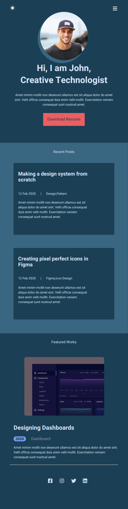

# Preview for My Submition
### Site in Light Mode (1024px):

 

  

### Site in Dark Mode (1024px):

  

### Site in Light Mode (768px):

  

### Site in Dark Mode (768px):

  

### Site in Light Mode (640px):

  

### Site in Dark Mode (640px):

  

